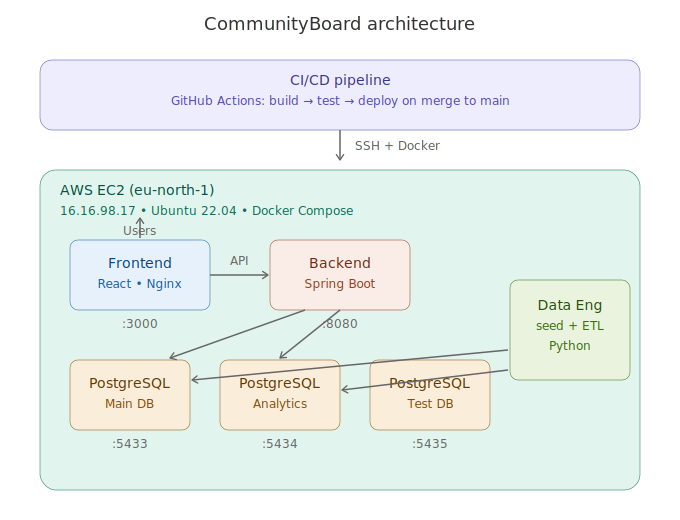

# CommunityBoard
**AmaliTech Phase 1 Project – Team 3**

A neighborhood bulletin board application where residents can create posts, comment, and view community engagement through an analytics dashboard.

## Architecture



## Live Demo

| Service | URL |
|---------|-----|
| Frontend | http://16.16.98.17:3000 |
| Backend API | http://16.16.98.17:8080/api/categories |
| Swagger Docs | http://16.16.98.17:8080/swagger-ui.html |

## Tech Stack

| Layer | Technology |
|-------|------------|
| Backend | Java 17, Spring Boot 3.2, Spring Security (JWT), JPA, PostgreSQL |
| Frontend | React 18, TypeScript, Vite, Axios, Chart.js |
| Data Engineering | Python 3.11, Pandas, ETL pipeline |
| QA | REST Assured (API), Selenium WebDriver (UI) |
| DevOps | Docker, Docker Compose, GitHub Actions CI/CD, Terraform, AWS EC2 |

## Getting Started
```bash
# Clone and start
git clone git@github.com:AmaliTech-Training-Academy/communityboard-team-3.git
cd communityboard-team-3
cp .env.example .env
docker compose up --build
```

- Frontend: http://localhost:3000
- Backend API: http://localhost:8080/swagger-ui.html

## Default Credentials

| Email | Password | Role |
|-------|----------|------|
| admin@amalitech.com | password123 | ADMIN |
| user@amalitech.com | password123 | USER |

## Project Structure
```
backend/          - Spring Boot REST API
frontend/         - React 18 SPA (TypeScript)
data-engineering/ - Python ETL & analytics pipeline
qa/               - API & UI test suites
devops/           - Terraform IaC, CI/CD configs
docs/             - Documentation
```

## Features Implemented

- [x] User registration and login with JWT authentication
- [x] CRUD operations for posts with 4 categories (News, Events, Discussion, Alerts)
- [x] Comment system on posts
- [x] Search and filter posts by category, date, and keyword
- [x] Analytics dashboard (posts per category, activity trends, top contributors)
- [x] CI/CD pipeline with automated testing and deployment
- [x] Infrastructure as Code (Terraform)
- [x] Live AWS deployment

## CI/CD Pipeline

Every push triggers:
- ✅ Backend Build & Test
- ✅ Frontend Build & Test  
- ✅ Docker Build Test
- ✅ Integration Test
- ✅ Deploy to EC2 (on merge to main)

## Documentation

- [Setup Guide](SETUP.md)
- [Database Schema](data-engineering/docs/DATABASE.md)
- [DevOps Docs](docs/)

## Team

| Role | Name |
|------|------|
| Backend | Bruce Mutsinzi |
| Frontend | Emmanuel Joe Letsu |
| QA | Divine Gihozo Bayingana |
| DevOps | Joel Alumasa |
| Data Engineering | Ernest Kwisanga |
| Product Owner | Lute |
