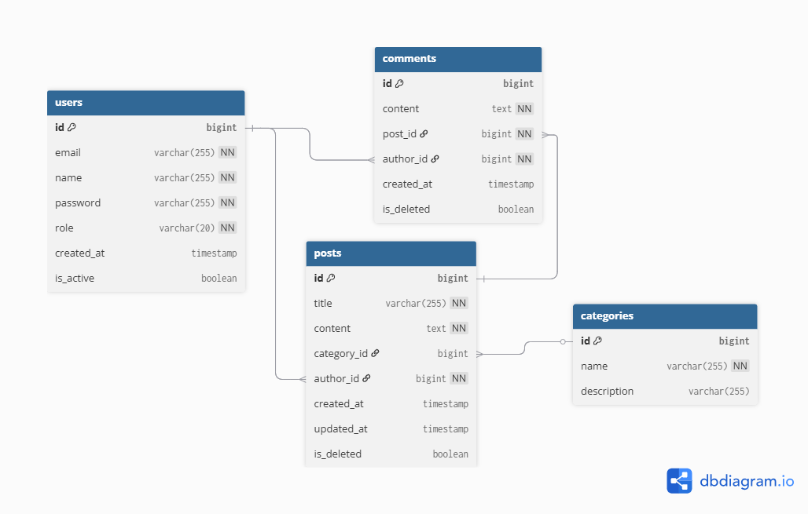

# Community Board: Database Documentation

> **Database Engine:** PostgreSQL  
> **ORM:** Hibernate (Spring Data JPA) with `ddl-auto: update`  
> **Schema Management:** Entity-driven (JPA annotations) + [Sample data by script `seed_data.py`](../seed_data.py) for seed data 
> **Default Database Name:** `communityboard`

---

## Table of Contents

1. [Overview](#overview)  
2. [Entity-Relationship Diagram](#entity-relationship-diagram)  
3. [Tables](#tables)  
   - [users](#users)  
   - [categories](#categories)  
   - [posts](#posts)  
   - [comments](#comments)  
4. [Relationships](#relationships)  
5. [Indexes and Constraints](#indexes-and-constraints)  
6. [Enumerations](#enumerations)  
7. [Seed Data](#seed-data)  
8. [Analytics Tables (ETL-Generated)](#analytics-tables-etl-generated)  
9. [Connection Configuration](#connection-configuration)

---

## Overview

The Community Board database stores all persistent state for a community notice board application. It supports user authentication, categorised posts (announcements, events, discussions, alerts), and threaded comments. The schema follows a relational model with four core tables and uses PostgreSQL-native identity columns for primary key generation.

Soft-deletion is used for posts and comments (`is_deleted` flag) so that records are never physically removed, preserving referential integrity and enabling audit trails.

---

## Entity-Relationship Diagram

## Tables

### `users`

Stores registered accounts. Every person who interacts with the system (posting, commenting, or administrating) has a row in this table.

| Column       | Type           | Nullable | Default               | Description                                                                                         |
|-------------|----------------|----------|-----------------------|-----------------------------------------------------------------------------------------------------|
| `id`        | `BIGINT`       | NO       | Auto-generated (IDENTITY) | Unique identifier for the user. Generated automatically by PostgreSQL's `GENERATED ALWAYS AS IDENTITY`. |
| `email`     | `VARCHAR(255)` | NO       | —                     | User's email address. Used as the login credential. Must be unique across all accounts.              |
| `name`      | `VARCHAR(255)` | NO       | —                     | Display name shown on posts and comments.                                                           |
| `password`  | `VARCHAR(255)` | NO       | —                     | BCrypt-hashed password. Never stored in plain text in production.                                    |
| `role`      | `VARCHAR(20)`  | NO       | `'USER'`              | Authorization role. Stored as a string enum value (`USER` or `ADMIN`). See [Enumerations](#enumerations). |
| `created_at`| `TIMESTAMP`    | YES      | `CURRENT_TIMESTAMP`   | Timestamp of when the account was created.                                                          |
| `is_active` | `BOOLEAN`      | YES      | `TRUE`                | Whether the account is active. Inactive users cannot authenticate.                                   |

**Constraints:**
- `PRIMARY KEY (id)`
- `UNIQUE (email)`

---

### `categories`

Defines the classification system for posts. Categories are pre-seeded and represent the type of content being shared on the board.

| Column        | Type           | Nullable | Default               | Description                                                                 |
|--------------|----------------|----------|-----------------------|-----------------------------------------------------------------------------|
| `id`         | `BIGINT`       | NO       | Auto-generated (IDENTITY) | Unique identifier for the category.                                         |
| `name`       | `VARCHAR(255)` | NO       | —                     | Category label (e.g., `NEWS`, `EVENT`, `DISCUSSION`, `ALERT`). Must be unique. |
| `description`| `VARCHAR(255)` | YES      | `NULL`                | Optional human-readable explanation of what the category is for.            |

**Constraints:**
- `PRIMARY KEY (id)`
- `UNIQUE (name)`

---

### `posts`

The central content table. Each row represents a single community board posting an announcement, event notice, discussion thread, or alert.

| Column        | Type           | Nullable | Default               | Description                                                                                     |
|--------------|----------------|----------|-----------------------|-------------------------------------------------------------------------------------------------|
| `id`         | `BIGINT`       | NO       | Auto-generated (IDENTITY) | Unique identifier for the post.                                                                 |
| `title`      | `VARCHAR(255)` | NO       | —                     | Short headline or subject line for the post.                                                    |
| `content`    | `TEXT`          | NO       | —                     | Full body text of the post. Stored as PostgreSQL `TEXT` to accommodate long-form content.         |
| `category_id`| `BIGINT`       | YES      | `NULL`                | Foreign key referencing `categories.id`. Nullable to allow uncategorised posts.                  |
| `author_id`  | `BIGINT`       | NO       | —                     | Foreign key referencing `users.id`. Identifies which user created the post.                      |
| `created_at` | `TIMESTAMP`    | YES      | `CURRENT_TIMESTAMP`   | Timestamp of when the post was first created.                                                   |
| `updated_at` | `TIMESTAMP`    | YES      | `CURRENT_TIMESTAMP`   | Timestamp of the most recent edit. Updated by the application on every modification.             |
| `is_deleted` | `BOOLEAN`      | YES      | `FALSE`               | Soft-delete flag. When `TRUE`, the post is hidden from normal queries but retained in the database. |

**Constraints:**
- `PRIMARY KEY (id)`
- `FOREIGN KEY (category_id)` → `categories(id)` — named `fk_post_category`
- `FOREIGN KEY (author_id)` → `users(id)` — named `fk_post_author`

---

### `comments`

Stores user responses to posts. Comments are scoped to a single post and are displayed in chronological order.

| Column       | Type           | Nullable | Default               | Description                                                                                          |
|-------------|----------------|----------|-----------------------|------------------------------------------------------------------------------------------------------|
| `id`        | `BIGINT`       | NO       | Auto-generated (IDENTITY) | Unique identifier for the comment.                                                                   |
| `content`   | `TEXT`          | NO       | —                     | The comment body. Stored as `TEXT` for variable-length user input.                                    |
| `post_id`   | `BIGINT`       | NO       | —                     | Foreign key referencing `posts.id`. Links the comment to the post it belongs to.                      |
| `author_id` | `BIGINT`       | NO       | —                     | Foreign key referencing `users.id`. Identifies which user wrote the comment.                          |
| `created_at`| `TIMESTAMP`    | YES      | `CURRENT_TIMESTAMP`   | Timestamp of when the comment was written.                                                           |
| `is_deleted`| `BOOLEAN`      | YES      | `FALSE`               | Soft-delete flag. When `TRUE`, the comment is hidden from display but retained for data integrity.    |

**Constraints:**
- `PRIMARY KEY (id)`
- `FOREIGN KEY (post_id)` → `posts(id)` — named `fk_comment_post`
- `FOREIGN KEY (author_id)` → `users(id)` — named `fk_comment_author`

---

## Relationships

| Relationship            | Type        | Description                                                           |
|------------------------|-------------|-----------------------------------------------------------------------|
| `users` → `posts`      | One-to-Many | A user can author many posts. Each post has exactly one author.       |
| `users` → `comments`   | One-to-Many | A user can write many comments. Each comment has exactly one author.  |
| `categories` → `posts` | One-to-Many | A category can contain many posts. A post belongs to zero or one category. |
| `posts` → `comments`   | One-to-Many | A post can have many comments. Each comment belongs to exactly one post. |

All foreign keys use an **eager fetch strategy** in the JPA layer (`FetchType.EAGER`) to ensure related entities are loaded alongside the parent entity.

---

## Indexes and Constraints

PostgreSQL automatically creates indexes for primary keys and unique constraints. The following indexes exist:

| Index                     | Table        | Column(s)     | Type          | Created By        |
|--------------------------|-------------|---------------|---------------|-------------------|
| `users_pkey`             | `users`     | `id`          | Primary Key   | Auto              |
| `users_email_key`        | `users`     | `email`       | Unique        | Auto              |
| `categories_pkey`        | `categories`| `id`          | Primary Key   | Auto              |
| `categories_name_key`    | `categories`| `name`        | Unique        | Auto              |
| `posts_pkey`             | `posts`     | `id`          | Primary Key   | Auto              |
| `comments_pkey`          | `comments`  | `id`          | Primary Key   | Auto              |

Foreign key columns (`category_id`, `author_id`, `post_id`) do not have explicit indexes beyond the constraint. Adding indexes on these columns is recommended for production workloads with large datasets.

---

## Enumerations

### `Role`

Defined in `com.amalitech.communityboard.model.enums.Role` and stored as a string in the `users.role` column.

| Value   | Description                                                                                  |
|---------|----------------------------------------------------------------------------------------------|
| `USER`  | Standard user. Can create posts and comments, and edit or delete their own content.          |
| `ADMIN` | Administrator. Has full access including moderation capabilities and system management.       |

---

## Seed Data

The application ships with initial data loaded via `data.sql` on startup. Inserts are idempotent (using `ON CONFLICT DO NOTHING` or `WHERE NOT EXISTS` guards).

### Default Categories

| Name         | Description                  |
|-------------|------------------------------|
| `NEWS`      | General news for the community |
| `EVENT`     | Upcoming events              |
| `DISCUSSION`| Community discussions        |
| `ALERT`     | Urgent alerts                |

### Default Users

| Email                    | Name          | Role    | Notes                                          |
|--------------------------|---------------|---------|-------------------------------------------------|
| `admin@amalitech.com`   | Admin User    | `ADMIN` | Default administrator account.                 |
| `user@amalitech.com`    | Default User  | `USER`  | Default standard user for testing.             |

> **Note:** Default user passwords in `data.sql` are stored in plain text for initial bootstrap. The Spring Boot application hashes passwords with BCrypt during registration. In production, ensure all stored passwords are properly hashed.

### Extended Seed Data (Data Engineering)

The `data-engineering/seed_data.py` script generates additional realistic test data:

- **30 users** (IDs 100–129) with community-appropriate names and emails
- **80 posts** distributed across all four categories with realistic neighbourhood content
- **330 comments** distributed across posts with varied timestamps

Seed IDs start at 100 to avoid conflicts with application-generated records.

---

## Analytics Tables (ETL-Generated)

The data-engineering ETL pipeline (`data-engineering/etl_pipeline.py`) creates derived analytics tables. These are regenerated on each pipeline run (`if_exists='replace'`).

### `analytics_daily_activity`

| Column       | Type     | Description                                            |
|-------------|----------|--------------------------------------------------------|
| `date`      | `DATE`   | Calendar date of the activity.                         |
| `category`  | `TEXT`   | Category name (`NEWS`, `EVENT`, `DISCUSSION`, `ALERT`).|
| `post_count`| `INTEGER`| Number of posts created in that category on that date. |

---

## Connection Configuration

The application connects to PostgreSQL using the following environment variables:

| Variable                     | Default Value                                   | Used By          |
|-----------------------------|-------------------------------------------------|------------------|
| `SPRING_DATASOURCE_URL`    | `jdbc:postgresql://localhost:5432/communityboard` | Spring Boot      |
| `SPRING_DATASOURCE_USERNAME`| `postgres`                                      | Spring Boot      |
| `SPRING_DATASOURCE_PASSWORD`| `Your strong password`                           | Spring Boot      |
| `DB_HOST`                   | `localhost`                                      | Python ETL       |
| `DB_PORT`                   | `5432`                                           | Python ETL       |
| `DB_NAME`                   | `communityboard`                                 | Python ETL       |
| `DB_USER`                   | `postgres`                                       | Python ETL       |
| `DB_PASSWORD`               | `Your strong password`                           | Python ETL       |

In the Docker Compose environment, `DB_HOST` is set to `postgres` (the service name) and both the backend and data-engineering containers share the same database instance.
